# Langton's Ant

Brain scan? 

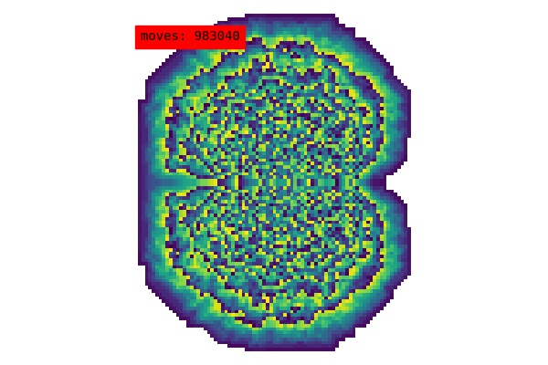

Map of an island archipelago? 

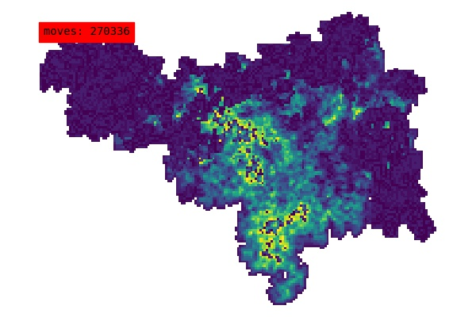

No. These are both examples of patterns generated by the famous "[Langton's Ant]([https://en.wikipedia.org/wiki/Langton%27s_ant](https://en.wikipedia.org/wiki/Langton's_ant))". The ant has a few very simple rules, as explained in [this video](https://www.youtube.com/watch?v=1X-gtr4pEBU). It produces initially chaotic behaviour, followed usually by the creation of some regular structure (a linear "highway") or a space-filling pattern:

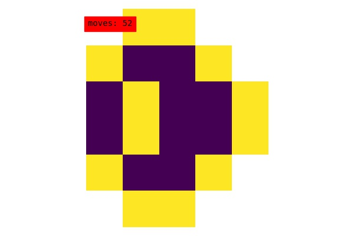

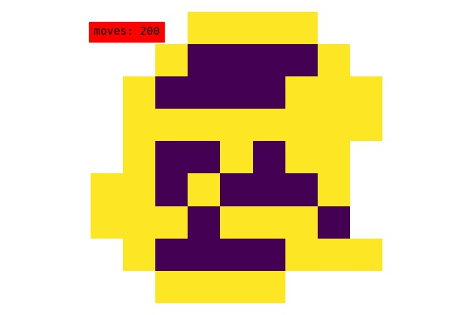

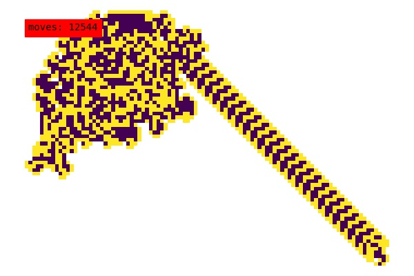

The classic ant produces a "highway" after about 12000 steps. 

## The rules

The "rules" followed by the ant can be defined as follows: for each colour square, a turn direction and next colour must be specified. 

The ant does this series of operations when it lands on a square: 

1. Change the colour of the square to nextColour
2. Update heading based on the turnDirection 
3. Move (set position = position + heading) 

The classic ant's rules are as follows: 

| colour | turnDirection | nextColour |
| ------ | ------------- | ---------- |
| 0      | R             | 1          |
| 1      | L             | 0          |

Using these rules, the ant would react to landing on a "0" square as follows: 

1. Change colour: Colour is 0, so set colour = nextColour = 1
2. Update heading: Colour is 1, so turn **left**
3. Move forward one square in the present direction 

*NOTE: all the images presented here were generated using matplotlib's "viridis" colourmap. Darker colours correspond to lower numbers, and vice versa.*

## More complex rules

We can define more colours to give rise to different ant behaviour. For example, the following rules give rise to a square space-filling pattern:  

| colour | turnDirection | nextColour |
| ------ | ------------- | ---------- |
| 0      | R             | 1          |
| 1      | R             | 2          |
| 2      | R             | 3          |
| 3      | L             | 4          |
| 4      | R             | 0          |

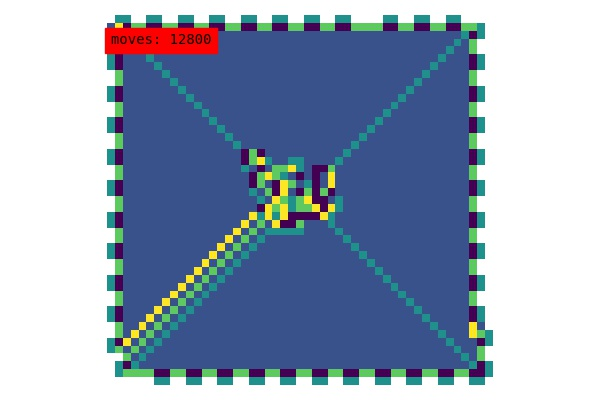

We can represent these rules by the sequence of turns in the turnDirection column ("RRRLR" in this case). This is a useful shorthand (assuming that each colour always points to the next higher colour---i.e. the nextColour column is always increasing by 1)

### Rule repetition

Repeating a ruleset---imagine Python's string multiplication: "RRL"*3 = "RRLRRLRRL"---produces the same shapes as the base ruleset, but with more depth of colour. This can be used to tell us a bit more about where the ant goes, because we can view cycles of movement which are longer than the base pattern. It also produces different, beautiful patterns. 

The following two images are of the rulesets "RLLR" and "RLLR9" after a hundred thousand steps.

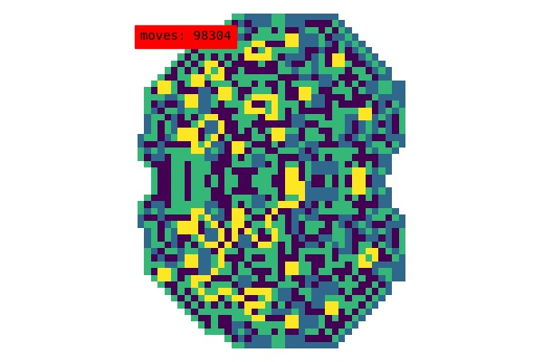

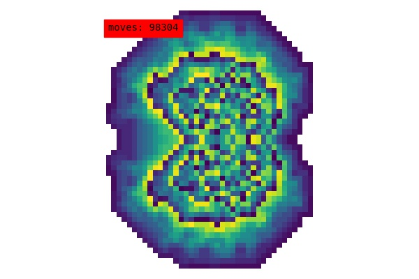

This particular ruleset appears to generate a fractal structure. Here is "RLLR9" after 1 million steps: 

## Colonies

Multiple ants can coexist on the same "board". This introduces some new concerns: 

1. What if two ants land on the same square at the same time?
2. What if two ants have different length rulesets e.g. "RRL" and "RLRLRRRLL"? What will the first ant do when it encounters a colour it doesn't know about?

I have solved these problems as follows: 

1. The ants are iterated one at a time---they move in the order in which they were added to the board. Therefore no two ants can try to move onto (or off) the same square at the same time. An ant _can_ modify the colour of a square occupied by another ant. That's fine. It's an ant-eat-ant world out there.
2. All ants "wrap" the value of the current square by the length of their own ruleset, using the modulo operator:  `currentColour = currentColour % len(ownRuleSet)`. So if an ant which knows 3 colours encounters a square with value 17, it will do `17 % 3 = 2` and consult its rule number 2. 

This means that a simple ant can traverse the territory of a complex ant without throwing an error. See below the interaction of "RRL" (which produces only dark colours) and "RRL9" (more yellow):

### Cooperation or chaos? 

What will happen when two ants meet? That depends on their behaviour. Two orderly space-filling ants can produce chaos when they meet, as is the case for "RRRLR" & "RLRRRRRLL":

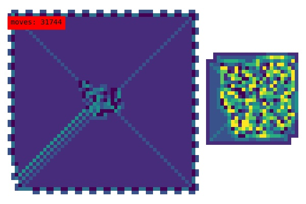

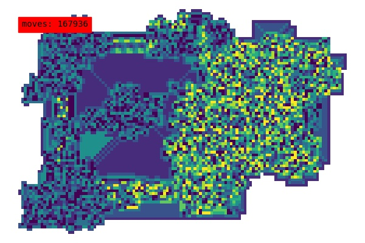

and "RLLRRLRRRRRR" & "RLRLRLLLLLLL":

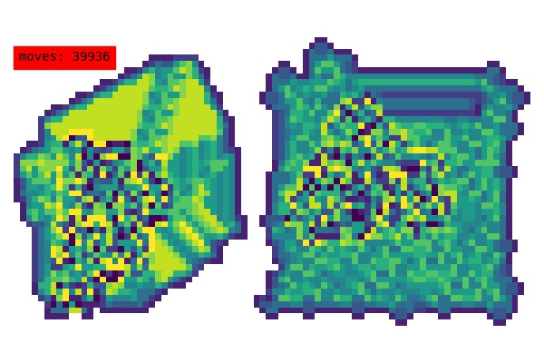

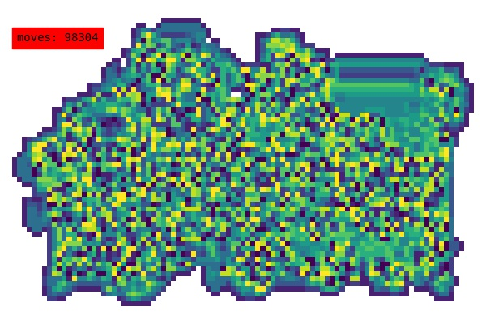

Or they can cooperate to produce a large superstructure, as "RLRRRRRLL" and "RLRRRRLLLRR" do:

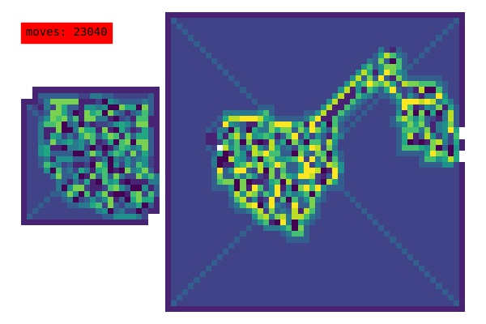

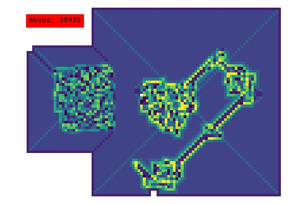

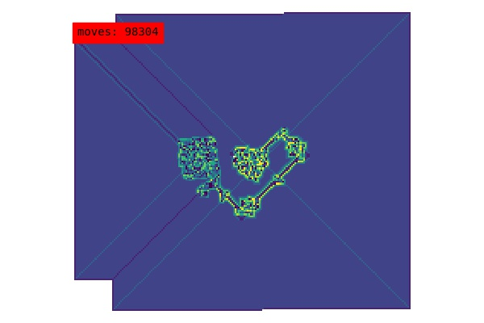

## More examples

See the `videos` folder for some interesting examples of space-filling behaviour, fractals, and ant interaction. Each video is named after the ant rulesets, followed by the total number of moves. So `rrl,rll9_500000.mp4`  is a video of two ants with rulesets "RRL" and "RRL9" which ran for 500 thousand steps. 